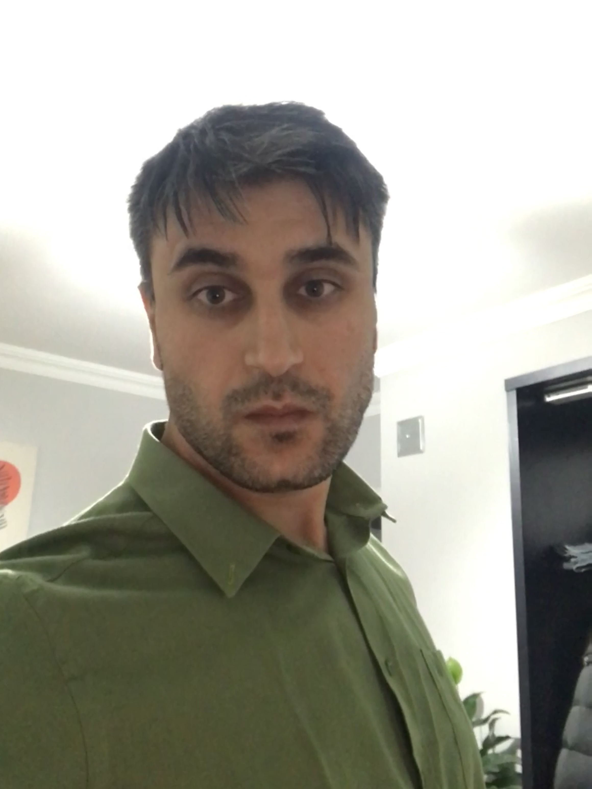

&nbsp;&nbsp;&nbsp;&nbsp;&nbsp;&nbsp;&nbsp;&nbsp;&nbsp;&nbsp;&nbsp;&nbsp;&nbsp;&nbsp;&nbsp;&nbsp;&nbsp;&nbsp;&nbsp;&nbsp;&nbsp;&nbsp;&nbsp;&nbsp;&nbsp;&nbsp;&nbsp;&nbsp;&nbsp;&nbsp;&nbsp;&nbsp;&nbsp;&nbsp;&nbsp;&nbsp;&nbsp;&nbsp;&nbsp;&nbsp;&nbsp;&nbsp;&nbsp;&nbsp;&nbsp;&nbsp;&nbsp;&nbsp;&nbsp;&nbsp;&nbsp;&nbsp;


Name: Muhlis

Surname: Gasanov

[comment]: <> (🔝 markdown has such a poor text indentation` 🔝)

Gender: MALE

Description: Born 01-14-1990; 6′1″ (186cm), brown eyes, black-grey hair, 207lbs (94kg).

Family background: Married to a beautiful woman who cooks the best cakes in the world

Localities frequented: Ukraine. Turkey. Belarus.

Criminal associates: JS, HTML, CSS

Modus operandi: Meticulously. Clearly. Maturely.

### Contacts:

e-mail📧: ulvi.epimetheus@gmail.com

Discord🎮(rs-school): Mezamorta(@DigitalChivalry)

### Competency:
<br>

|  Skills  | Level                                      | Examples                                                                                       |
|:--------:|:-------------------------------------------|:-----------------------------------------------------------------------------------------------|
| Markdown | I can create tables                        | Front of you                                                                                   |
|   CSS    | I can use splendid text-decorations        | _**~~Charming text~~**_ 🌼                                                                     |
|    JS    | I write an explosive code                  | `redButton.addEventListener('click', (nuclearLaunch) => alert('May the Lord preserve us...'))` |
|   HTML   | It's quite enough to count on a good offer | `<small>My chances</small>`                                                                    |


### Free code samples:

If you're === Aquarius♒ don't call me. We're incompatible.
``` javascript
function defineZodiacs(month, date) {
  let birthday = [addZeroTime(month), addZeroTime(date)].join('-');

  if (birthday <= '12-22' && birthday <= '01-19') {
    return 'You are Capricorn'
  } else if (birthday >= '01-20' && birthday <= '02-18') {
    return 'You are Aquarius'
  } else if (birthday >= '02-19' && birthday <= '03-20') {
    return 'You are Pisces'
  } else if (birthday >= '03-21' && birthday <= '04-19') {
    return 'You are Aries'
  } else if (birthday >= '04-20' && birthday <= '5-20') {
    return 'You are Taurus'
  } else if (birthday >= '05-21' && birthday <= '06-20') {
    return 'You are Gemini'
  } else if (birthday >= '06-21' && birthday <= '07-22') {
    return 'You are Cancer'
  } else if (birthday >= '07-23' && birthday <= '08-22') {
    return 'You are Leo'
  } else if (birthday >= '08-23' && birthday <= '09-22') {
    return 'You are Virgo'
  } else if (birthday >= '09-22' && birthday <= '10-22') {
    return 'You are Libra'
  } else if (birthday >= '10-23' && birthday <= '11-21') {
    return 'You are Scorpio'
  } else if (birthday >= '11-22' && birthday <= '12-21') {
    return 'You are Sagittarius'
  } else {
    return 'Don't be silly, darling and input your birthdate in a correct format'
  }
}

function addZeroTime(number) {
  if (number <= 9 && number >= 0) return '0' + number;
  return number
}

```
<br>
Please, share your thoughts💭:

```javascript
const userThoughts = prompt('Say something clever');

if (userThoughts === 'something stupid') alert('That is possibly the most disgusting, humiliating and potentially dangerous thing I ever saw.')
if (userThoughts === 'smart stuff')      alert("Not bad. At least you're more intelligent than my nasty neighbour")
```
<br>
Do you like me🤗?:

```javascript
const question = () => {
  let userOpinion = confirm('Do you like me?')

  !userOpinion ? question() : alert('I also like you')
}
question()
```
---
### Experience:
I wasted more than three hours to create this fancy CV to make you smile. My noble signor, is that not enough for you?

---
### Education:

> I saved myself — self-analysis, self-discipline, self-education, self-improvement.
>
>&nbsp;&nbsp;&nbsp;&nbsp;&nbsp;&nbsp;&nbsp;&nbsp;&nbsp;&nbsp;&nbsp;&nbsp;&nbsp;&nbsp;&nbsp;&nbsp;&nbsp;&nbsp;&nbsp;&nbsp;&nbsp;&nbsp;&nbsp;&nbsp;&nbsp;&nbsp;&nbsp;&nbsp;&nbsp;&nbsp;&nbsp;&nbsp;&nbsp;&nbsp;&nbsp;&nbsp;&nbsp;&nbsp;&nbsp;&nbsp;&nbsp;&nbsp;&nbsp;&nbsp;&nbsp;&nbsp;&nbsp;&nbsp;&nbsp;&nbsp;&nbsp;&nbsp;&nbsp;&nbsp;&nbsp;&nbsp;&nbsp;&nbsp;&nbsp;&nbsp;&nbsp;&nbsp;&nbsp;&nbsp;&nbsp;&nbsp;&nbsp;&nbsp;&nbsp;&nbsp;&nbsp;&nbsp;&nbsp;&nbsp;&nbsp;&nbsp;&nbsp;&nbsp;&nbsp;&nbsp;&nbsp;&nbsp;&nbsp;&nbsp;&nbsp;&nbsp;&nbsp;&nbsp;&nbsp;&nbsp;&nbsp;&nbsp;&nbsp;&nbsp;&nbsp;&nbsp;Eugène Ionesco.


----
### Languages:

**English level:** I'm certainly not Charles Dickens. However, I can bind a few words. The best reference will be... Perhaps you watched "the Mighty Boosh" show and remember "an alabaster retard" - the Moon🌚, that's my English level.

